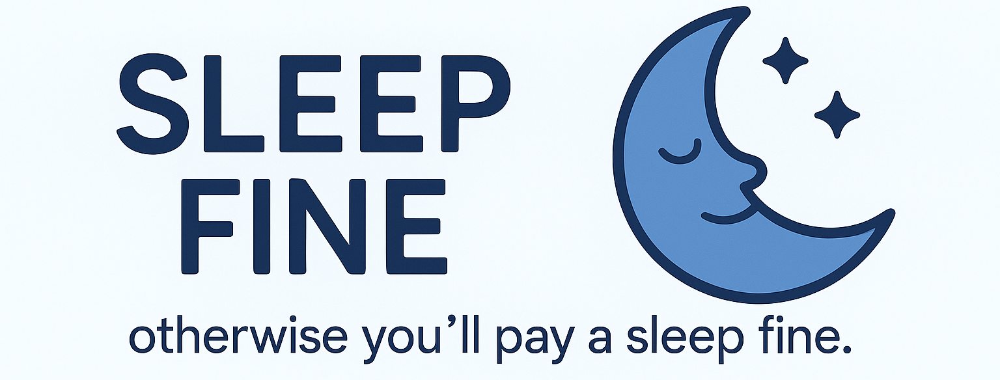

# 😴 Sleep Fine — A Crypto-Powered Habit Builder

**Sleep Fine** helps users commit to a better sleep schedule by combining behavioral accountability with crypto incentives. Users lock up funds in a smart contract as a commitment to sleep on time. If they fail to meet their sleep goal, part of the funds are deducted as a penalty. Remaining funds can be withdrawn upon successful completion.

---

## How does it work

- Users commit to sleep goals by locking up a deposit.
- Sleep data is read from Apple Health via Apple Watch.
- Penalties are applied automatically for missed sleep targets.
- Data tamper-resistance via app key and potential future attestation.
- Smart contract built for Westend Asset Hub (Kusama testnet).
- Mech AI agent integration to automate validator selection for nomination.

---

## Components

### 1. iOS App

- Integrates with **Apple HealthKit** to fetch sleep data.
- Secure Enclave key generation to bind app identity.
- Sends challenge creation and sleep reports to the smart contract.

### 2. Smart Contract

- Written in Solidity and compiled to RISC-V bytecode.
- Users can create sleep challenges, report daily sleep, and withdraw balance.
- Applies penalties for missed days and tracks user commitment.

### 3. Mech Agent (Validator Nomination)

- Uses `mech-client` to interact with Mech Marketplace.
- Sends validator list prompts and receives ranked suggestions.
- Calls smart contracts with selected validator addresses.

---

## Project Setup

### Prerequisites

- Node.js & Hardhat
- Python 3.10+ and Poetry
- iOS Device + Xcode (for the app)
- Docker (optional, for Mech automation or agent services)

---

## Smart Contract

### Deploying on Westend Asset Hub

```bash
cd smart-contract
npm install
npx hardhat compile
npx hardhat deploy --network westend
```

Contracts are compiled to RISC-V compatible bytecode using Parity’s cargo-contract and special Substrate compiler toolchain.

Penalty logic is based on missed days and withdrawal is allowed only after challenge completion.

## iOS App

- Written in Swift
- Uses Secure Enclave to generate a private key on first install
- Sleep tracking data pulled from Apple Watch via HealthKit
- Data submitted to the contract through app backend or directly on-chain
- Future: attestation and cryptographic signing of sleep data


## Mech Integration

### Use Case

Select top validators to nominate for staking based on uptime, stake, and duration.

### Flow
```
[Validator List]
      ↓
[Prompt Builder] → [Mech Client] → [Top 5 Validators]
                                        ↓
                            [Smart Contract Call]
```

### Run
```
cd mech-agent
poetry install
poetry run python run_mech_request.py
```
Currently triggered manually; planned automation via agent.

## License

This project is licensed under the MIT License.
